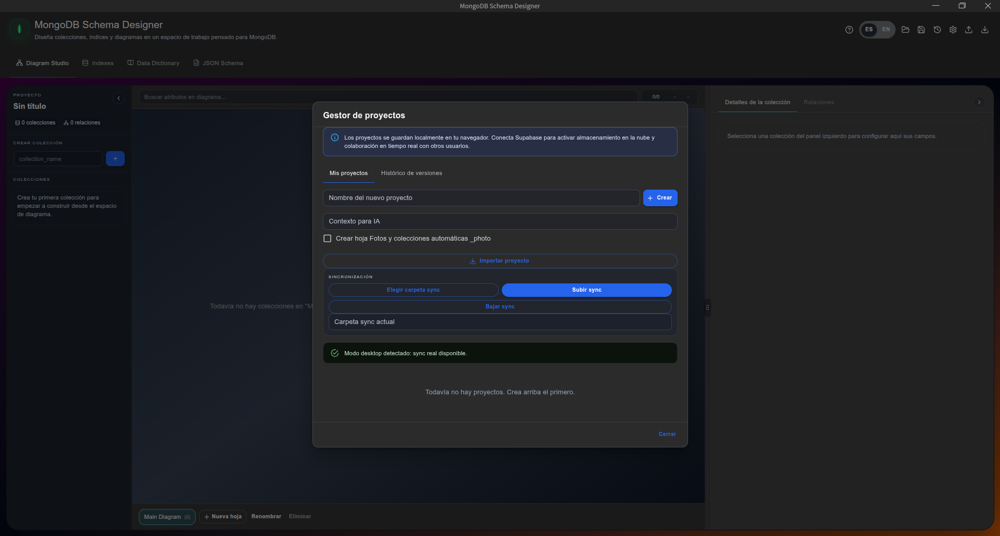
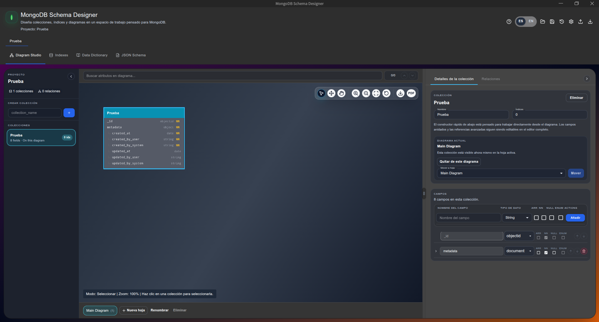
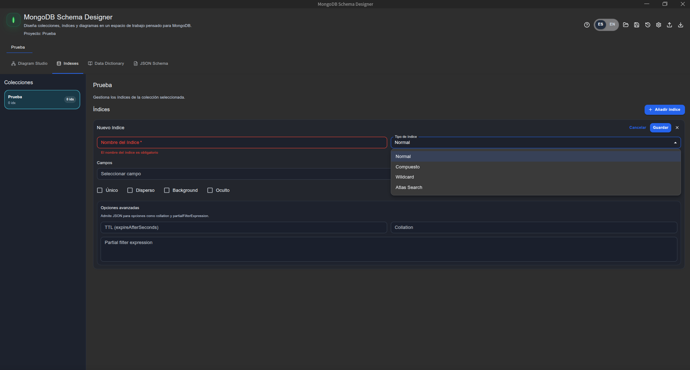
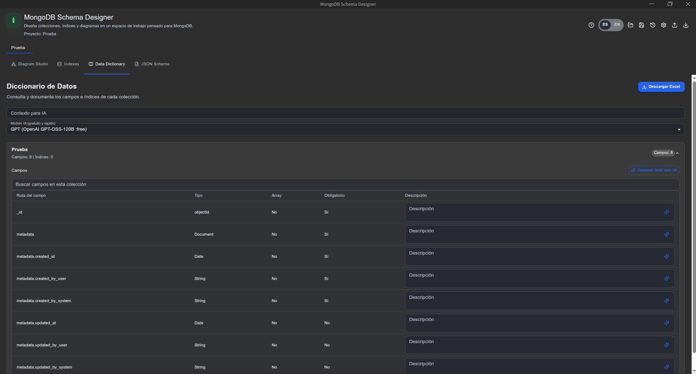
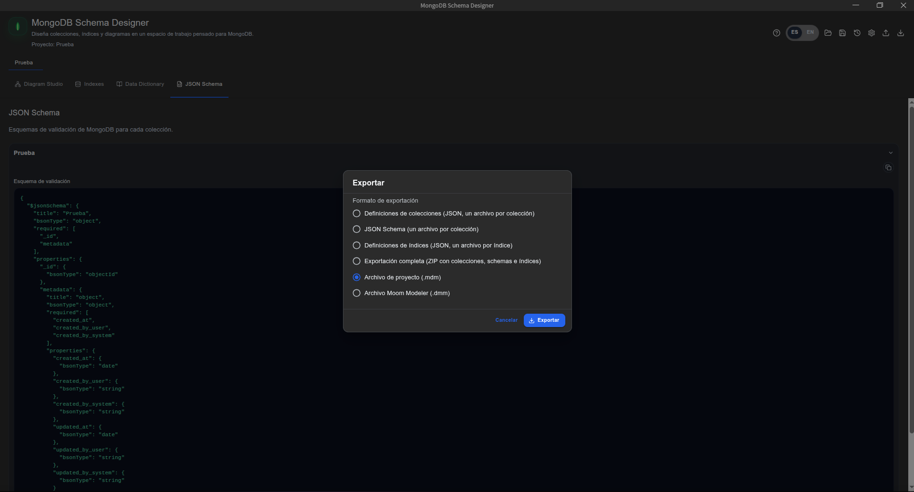
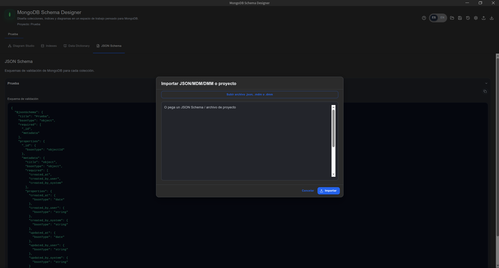

# MongoDB Model Viewer

**MongoDB Model Viewer** (nombre de escritorio: **MongoDBModeler**) es una aplicación de escritorio para diseñar y documentar modelos de datos de MongoDB. Permite definir colecciones y campos, visualizar diagramas y relaciones, gestionar índices, consultar el diccionario de datos e importar o exportar proyectos.

Está construida con React, Vite y Electron.

## Galería

| Gestor de proyectos | Diagram Studio |
| --- | --- |
|  |  |

| Gestión de índices | Diccionario de datos |
| --- | --- |
|  |  |

| Exportación de esquemas | Importación de proyectos y esquemas |
| --- | --- |
|  |  |

## Requisitos

- Node.js 20 o superior (se recomienda la versión LTS).
- npm (incluido con Node.js).
- Git, si se clona el repositorio.

Instala las dependencias desde la raíz del proyecto:

```bash
npm ci
```

Para ejecutar la versión web durante el desarrollo:

```bash
npm run dev
```

Para abrir la aplicación de escritorio en modo desarrollo:

```bash
npm run desktop:dev
```

## Asistente de IA

La aplicación puede usar un modelo de IA para redactar documentación a partir de la estructura del modelo MongoDB y del contexto que indiques. Sus funciones principales son:

- Generar descripciones breves para campos desde el **Diccionario de datos**.
- Generar la documentación del modelo, colecciones e índices desde la pestaña de documentación cuando esté habilitada.
- Usar un **contexto de proyecto** (por ejemplo, “facturación en España” o “historias clínicas”) para adaptar las descripciones al dominio de negocio.

### Configuración

1. Abre **Admin / Configuración** desde el icono de engranaje de la aplicación.
2. En la sección **IA**, introduce una clave de API compatible con OpenRouter.
3. Mantén la URL predeterminada o introduce la URL del endpoint de completions de tu proveedor:

   ```text
   https://openrouter.ai/api/v1/chat/completions
   ```

4. Elige el modelo predeterminado. La aplicación propone `openai/gpt-oss-120b:free` y también permite añadir identificadores de modelos personalizados.
5. Guarda los cambios. En el Diccionario de datos o al crear/editar un proyecto, rellena **Contexto para IA** y selecciona el modelo que quieras usar.

Para generar una descripción, utiliza el icono de IA junto a un campo o el botón **Generar todo con IA**. Revisa siempre el texto generado antes de usarlo como documentación definitiva.

> Seguridad: la configuración se guarda localmente en la aplicación. No incluyas tu clave de API en el repositorio, capturas de pantalla ni archivos compartidos. Si utilizas otro proveedor, debe ofrecer un endpoint compatible con el formato de chat completions de OpenAI.

## Interoperabilidad de archivos

Los proyectos se pueden guardar y compartir como archivos de modelo. Desde **JSON Schema → Exportar**, selecciona el formato correspondiente.

| Formato | Compatibilidad | Uso |
| --- | --- | --- |
| `.mdm` | MongoDB Compass Data Modeling Diagram | Exporta el proyecto en formato compatible con MongoDB Compass. Un archivo `.mdm` creado en MongoDBModeler se puede abrir en Compass, y los diagramas `.mdm` exportados desde Compass se pueden importar en MongoDBModeler. |
| `.dmm` | Moom Modeler | Importación y exportación bidireccional de modelos de Moom Modeler, incluidos colecciones, campos, índices, relaciones y hojas de diagrama cuando estén presentes. |
| `.json` | JSON Schema / definiciones JSON | Importa esquemas de validación JSON y exporta definiciones de colecciones, esquemas e índices. |

Para importar, abre la opción **Importar** y selecciona un archivo `.mdm`, `.dmm` o `.json`. Para exportar un proyecto completo, abre **JSON Schema → Exportar** y elige **Archivo de proyecto (.mdm)** o **Archivo Moom Modeler (.dmm)**.

## Compilar la aplicación

Los artefactos generados se guardan en `release/`. Esta carpeta no se versiona: los instaladores se publican como adjuntos de GitHub Releases.

Antes de crear una distribución, verifica que las dependencias estén instaladas:

```bash
npm ci
```

### Windows (x64)

Genera un ejecutable portable:

```bash
npm run desktop:dist:win
```

Para generar un instalador NSIS, usa:

```bash
npm run desktop:dist:win:installer
```

El resultado principal se crea en `release/` con extensión `.exe`.

### Linux (x64 y ARM64)

Para generar AppImage y paquetes Debian para ambas arquitecturas:

```bash
npm run desktop:dist:linux
```

También puedes compilar una arquitectura concreta:

```bash
npm run desktop:dist:linux:x64
npm run desktop:dist:linux:arm64
```

Los resultados se crean en `release/` como `.AppImage` y `.deb`.

### macOS (Apple Silicon y Intel)

Para generar imágenes DMG y archivos ZIP:

```bash
npm run desktop:dist:mac
```

Para una sola arquitectura:

```bash
npm run desktop:dist:mac:arm64
npm run desktop:dist:mac:x64
```

Los resultados se crean en `release/` como `.dmg` y `.zip`.

> La compilación y firma de aplicaciones macOS debe hacerse en un equipo macOS. Para publicar fuera de pruebas, configura la firma y notarización de Apple; de lo contrario macOS puede mostrar advertencias de seguridad.

### Compilación web y empaquetado de prueba

```bash
npm run build
npm run desktop:pack
```

`npm run build` genera los archivos web en `dist/`. `npm run desktop:pack` crea una aplicación sin instalador dentro de `release/`.

## Publicar una versión

1. Actualiza `version` en `package.json`.
2. Genera los instaladores de las plataformas que vayas a distribuir.
3. Crea una GitHub Release con una etiqueta como `v1.0.6`.
4. Adjunta los archivos de `release/` correspondientes (`.exe`, `.AppImage`, `.deb`, `.dmg` o `.zip`).

No añadas `release/`, `node_modules/`, `dist/` ni `tmp/` al repositorio: se generan localmente y están incluidos en `.gitignore`.

## Licencia

Consulta [LICENSE.md](LICENSE.md).
